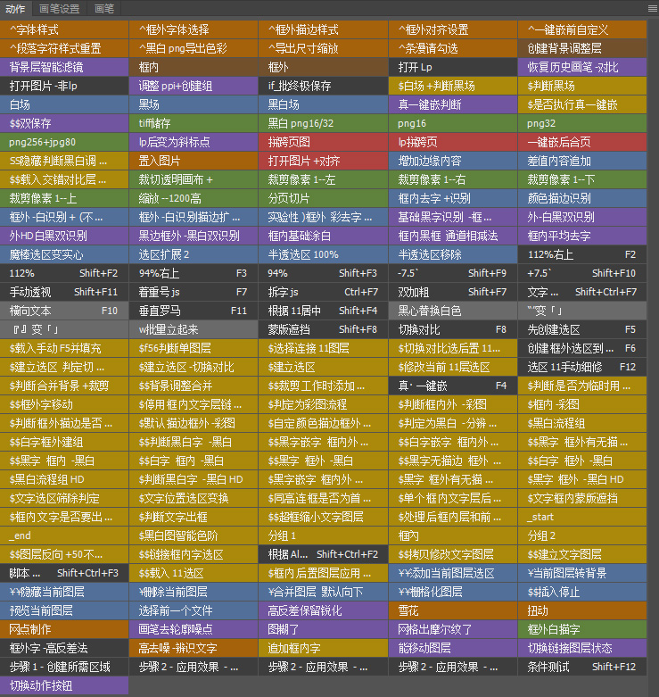

> [!IMPORTANT]
> **该工具一直都是自用为主没经过广泛测试，欢迎有能力大佬提建议一起改进让其变得更好用**
## 支持范围
支持彩色漫画、黑白漫画、美漫、条漫  
支持LabelPlus和传统嵌字方式  
## 内容
自用改版LabelPlus脚本，增加一些功能和更好用的界面修改  
自用一键处理框内外字的动作逻辑组F4  
# 实现功能（未全部列出
自动判断彩色黑白图片  
自动缩小框内字避免过大出框  
彩图自动修改文字颜色为原图字体颜色  
一键合并跨页图  
一键  
高效调节字符和段落样式  
高效修改文字图层样式  

# 安装方式
1.首先你需要安装Photoshop，最好是2019版本可直接覆盖配置文件无需自己手动修改（因本人用2019ps故只提供此版本的配置文件打包）理论来说只要是cc2015以上版本皆可通用，但细微地方需要能自己动手调试  

2.将[最新版](https://github.com/qwea12c/Photoshop-Settings-file-for-comic-embedding/releases/latest)中的Adobe Photoshop CC 2019 Settings.7z内的文件夹解压到系统个人ps设置目录下（记得保存自己的配置文件）默认目录为“C:\Users\[你的用户名]\AppData\Roaming\Adobe\Adobe Photoshop CC 2019”  

3.将[最新版](https://github.com/qwea12c/Photoshop-Settings-file-for-comic-embedding/releases/latest)中的Scripts.7z内的所有文件解压到ps软件目录下，位置为“你的ps软件根目录\Presets\Scripts”  

4.需要用到非LabelPlus文本也就是传统txt稿子嵌字功能需先安装[AutoHotkey](https://www.autohotkey.com/)软件，然后下载保留[非lp文本导入.ahk](https://github.com/qwea12c/Photoshop-Settings-file-for-comic-embedding/blob/main/%E9%9D%9Elp%E6%96%87%E6%9C%AC%E5%AF%BC%E5%85%A5.ahk)文件  

5.默认配置文件需要[toolbox字体包](https://github.com/qwea12c/Photoshop-Settings-file-for-comic-embedding/releases/tag/font_v2.6)和[jojo热情字体包v1.1（2021）](https://github.com/jqk4388/JOJOHOTfont/releases/tag/1.1)，需全部安装里面的字体  

6.打开cmd输入命令“subst z: d:\1”，d:\1替换为你要保存导出文件的目录地址，要求该目录下要新建好名为jpg，png，Tiff的三个空文件夹。因为一键保存功能已经设置好文件存储位置“Z:\jpg，Z:\png，Z:\Tiff”，所以需要映射一个该目录，本人是通过Ramdisk虚拟的z盘

# 使用方法

  
b站的一些使用演示视频，功能啥的可以对照视频慢慢研究
https://space.bilibili.com/2521037

# 感谢
[LabelPlus - Easy comic translation tool](https://noodlefighter.com/label_plus/)
神一样的脚本，lp稿子的嵌字部分主要都是围绕它来进行修改的

[jqk4388/JOJOHOTfont: 基於華康方正並添加了斜體連字特性的日漫漢化專用字體](https://github.com/jqk4388/JOJOHOTfont)和[auto_emphasis](https://github.com/jqk4388/auto_emphasis)
繁体汉化最好用的字体包了，还有他的着重号脚本也及其实用

toolbox字体包
团子组Q佬精心制作，造福了很多个汉与小型简体汉化组，也包括了我。

# 打赏喂饭
饿 增加点打赏福利？可以为支持过我的人qq远程协助解决些嵌字或一些电脑问题。。

# 联系我
提交问题或帮忙改进的佬+群：657723184  
b站留言和评论不经常看
